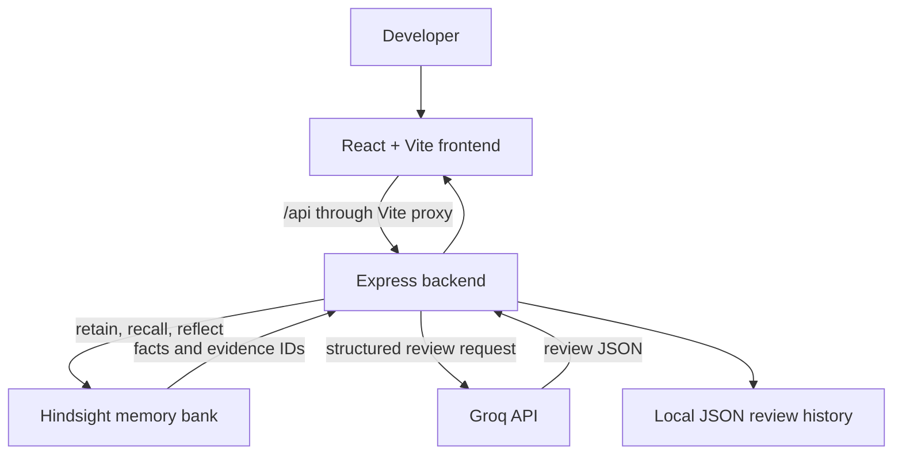

# CodeMemory Project Demo

## 1. What CodeMemory Does

CodeMemory is a team-aware AI code review workspace. It reviews submitted code with Groq, but also remembers the engineering standards and decisions that a team teaches it through Hindsight.

Instead of producing the same generic review for every team, CodeMemory:

1. Receives a code snippet or pull-request diff.
2. Retrieves relevant team preferences from a Hindsight memory bank.
3. Reflects on the retrieved memories to identify applicable conventions.
4. Sends the code, language, and team context to Groq for a structured review.
5. Displays findings, risks, recommendations, and the evidence behind team-specific advice.
6. Retains explicit team standards and accepted or rejected recommendations for future reviews.

Source code is sent to the configured review provider for the current review. Raw source code is not stored in team memory.

## 2. The Problem

Generic AI code reviewers often repeat broad advice and forget decisions that are specific to a team, repository, or architecture. CodeMemory creates persistent engineering context so reviews become more consistent with the way a team actually builds software.

Examples of team knowledge CodeMemory can remember:

- Prefer `async`/`await` instead of Promise chains.
- Use repository-specific error handling patterns.
- Avoid introducing a new dependency for small utilities.
- Treat a particular API response as nullable.
- Require tests for changes to a specific service.

## 3. Main Demo Features

### Structured Code Review

Users select a language, paste code or a diff, and submit it for review. The result is organized into:

- Overall summary
- Risk level
- Findings
- Recommendations
- Team-specific evidence

The review is limited to 24,000 characters to keep requests predictable.

### Persistent Team Memory

Users can teach CodeMemory an explicit engineering standard. The standard is retained in one deterministic Hindsight bank identified by `CODEMEMORY_TEAM_ID`.

The Team memory view shows the standards currently available to future reviews.

### Evidence-Based Recommendations

When Hindsight recalls a relevant memory, CodeMemory includes the retrieved memory IDs and context with the review. Recommendations must reference evidence that was actually returned by recall. Unsupported evidence IDs are removed by the backend.

This makes team-specific recommendations explainable rather than opaque.

### Feedback Learning

Users can accept or reject recommendations. That decision is retained as feedback and can influence later reviews.

### Guided Demo Scenario

The guided scenario demonstrates the learning loop:

1. Review an initial Promise-chain example.
2. Teach the team to prefer `async`/`await`.
3. Review another Promise-chain example.
4. Observe the preference being recalled and used in the recommendation.

The scenario uses real Hindsight retain, recall, and reflect calls. It does not hardcode a fake learned result.

### Review History

Completed review results are stored locally in a JSON history file. Users can inspect earlier reviews and their feedback without adding a database to the demo.

### Integration Health

The interface reports whether the backend, Hindsight, and Groq integrations are available. The backend health endpoint returns a degraded status while either required integration is unavailable.

## 4. Technology Stack

### Frontend

- React 19
- Vite 6
- Tailwind CSS 4
- Lucide React icons
- Responsive dashboard UI

### Backend

- Node.js
- Express 5
- Native Node test runner
- ES modules
- Local JSON review history
- `@vectorize-io/hindsight-client` 0.10.1

### AI and Memory Services

- Hindsight for retain, recall, reflect, and team memory
- Groq OpenAI-compatible chat completions for code review generation
- Structured JSON review responses

## 5. Architecture



## 6. How a Review Works

### Step 1: Submit Code

The frontend sends the selected language and code to:

```text
POST /api/review
```

The backend validates the input and rejects empty submissions or code larger than 24,000 characters.

### Step 2: Prepare the Memory Bank

The backend creates or reuses the bank identified by `CODEMEMORY_TEAM_ID`. All team standards, review feedback, and short review outcomes are scoped to that bank.

### Step 3: Recall Relevant Context

The backend queries Hindsight using the language and patterns found in the submission. Retrieved memories become the review's team context and evidence list.

### Step 4: Reflect on Conventions

When relevant memories are found, Hindsight Reflect synthesizes the applicable conventions. Reflection is skipped when recall returns no facts.

### Step 5: Generate the Review

The backend sends Groq:

- The submitted code
- The selected language
- Recalled team facts
- Reflection about applicable conventions
- Instructions to return the structured review format

The backend validates and normalizes the response before returning it to the frontend.

### Step 6: Show Explainable Results

The frontend renders the summary, risk, findings, recommendations, and supporting memory evidence. The review is also written to local history.

### Step 7: Learn from Feedback

When a user accepts or rejects a recommendation, CodeMemory retains that decision in Hindsight. Future recalls can use that feedback as additional team context.

## 7. API Endpoints

All backend routes are under `/api`.

| Method | Endpoint | Purpose |
| --- | --- | --- |
| `GET` | `/api/health` | Reports backend, Hindsight, and Groq readiness. |
| `POST` | `/api/review` | Reviews `{ code, language }`. |
| `POST` | `/api/memory` | Stores an explicit team standard. |
| `GET` | `/api/memory` | Lists up to 50 team memories. |
| `POST` | `/api/memory/feedback` | Stores accepted or rejected recommendation feedback. |
| `GET` | `/api/reviews` | Lists saved review history. |
| `GET` | `/api/reviews/:id` | Returns one saved review and its evidence. |

## 8. Local Demo Setup

Requirements:

- Node.js 20 or newer
- npm
- A reachable Hindsight API or Hindsight Cloud account
- A Groq API key

Install dependencies:

```powershell
Set-Location codememory\backend
npm install
Set-Location ..\frontend
npm install
```

Create `backend/.env` with the backend configuration:

```dotenv
HINDSIGHT_API_URL=https://api.hindsight.vectorize.io
HINDSIGHT_API_KEY=your-hindsight-key
GROQ_API_KEY=your-groq-key
GROQ_MODEL=openai/gpt-oss-120b
CODEMEMORY_TEAM_ID=demo-team
PORT=8080
```

Create `frontend/.env.local` for local proxying:

```dotenv
VITE_API_PROXY_TARGET=http://127.0.0.1:8080
```

Run the backend in one terminal:

```powershell
Set-Location codememory\backend
npm run dev
```

Run the frontend in a second terminal:

```powershell
Set-Location codememory\frontend
npm run dev
```

Open:

```text
http://localhost:5173
```

Verify the backend:

```text
http://localhost:8080/api/health
```

A ready response looks like:

```json
{
  "status": "ready",
  "teamId": "demo-team",
  "integrations": {
    "hindsight": "connected",
    "groq": "configured"
  }
}
```

## 9. Suggested Live Demo Script

1. Open the CodeMemory dashboard and show the `Systems connected` status.
2. Click **Load Demo Scenario**.
3. Explain that the first review has no learned team preference yet.
4. Show the initial review findings and evidence panel.
5. Teach the standard: “Prefer async/await over Promise chains.”
6. Open Team memory and show the stored preference.
7. Run the second review from the guided scenario.
8. Point out the recalled memory and the recommendation grounded in that evidence.
9. Accept or reject the recommendation.
10. Open Review history to show the persisted review and feedback.

## 10. What Makes the Demo Valuable

CodeMemory demonstrates a complete feedback loop rather than a one-shot AI call:

```text
Team decision
    -> Hindsight retain
    -> Hindsight recall
    -> Hindsight reflect
    -> Groq review
    -> Human feedback
    -> Hindsight retain
```

The important product idea is that the reviewer becomes more aligned with the team over time while keeping the recommendation traceable to actual stored evidence.

## 11. Current Scope and Limitations

- Team membership and authentication are not included.
- Review history uses a local JSON file rather than a production database.
- The backend expects a reachable Hindsight deployment and Groq credentials.
- The demo uses one configured team bank per backend instance.
- The frontend is designed for local development and can be deployed separately from the backend.

## 12. Future Improvements

- Add authenticated team membership and repository-level permissions.
- Replace local JSON history with a durable database.
- Add GitHub pull-request integration.
- Support repository and branch context in recall queries.
- Add configurable review policies and severity thresholds.
- Add usage, latency, and cost observability.