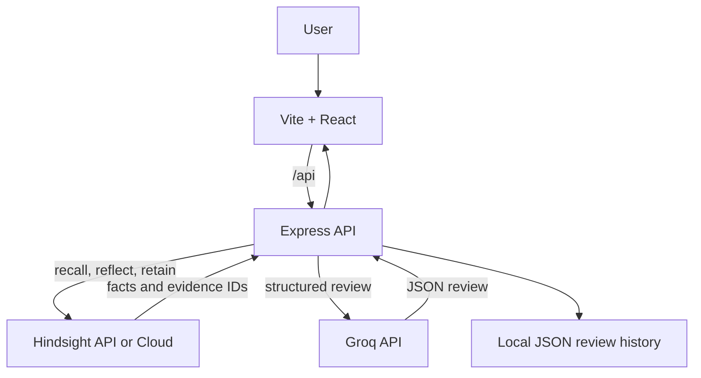

# CodeMemory

AI code review that learns how your team writes software.

## Problem

Generic AI code reviewers repeat general advice and forget the coding standards, architectural preferences, and decisions a team has already established.

## Solution

CodeMemory retrieves relevant team knowledge from a deterministic Hindsight bank before each review. Groq receives the current code, language, recalled facts, and Hindsight's reflection on applicable conventions. Reviewers can teach preferences directly and accept or reject recommendations; explicit feedback is retained for later retrieval. Source code is not retained in Hindsight: only concise review outcomes and explicit team decisions are stored.

## Why Hindsight

- **Retain:** Store explicit coding standards, accepted/rejected recommendation feedback, and short review outcomes in the `CODEMEMORY_TEAM_ID` bank. Every retain includes category/source metadata and tags.
- **Recall:** Search the bank with the language and patterns found in the submitted change before asking Groq to review it. The returned facts and metadata become the review's evidence list.
- **Reflect:** When recall returns facts, call Hindsight Reflect to synthesize applicable conventions. Groq is instructed to cite only IDs from the actual recall results for team-specific recommendations; the API removes unsupported IDs and recommendations.

The guided scenario uses those same API calls. It cannot report a learned preference unless Hindsight accepted the retain and returns a relevant memory during the second review.

## Architecture



## Features

- Structured code review with summary, risk, findings, and recommendations
- Deterministic, per-team Hindsight bank
- Team-specific recommendations grounded in retrieved Hindsight records
- Explainable recommendations with the exact retrieved memory evidence
- Explicit preference teaching and accepted/rejected review feedback
- Review history stored in a small local JSON file
- Guided before/learn/after scenario using real Hindsight and Groq requests
- Responsive developer-focused dashboard with integration health reporting

## Tech Stack

- React 19, Vite, Tailwind CSS 4, Lucide icons
- Node.js, Express 5
- `@vectorize-io/hindsight-client` 0.10.1
- Groq OpenAI-compatible chat completions API
- Node.js built-in test runner

## Setup

Requirements: Node.js 20 or newer, npm, and a reachable Hindsight API (self-hosted or Hindsight Cloud). Groq API credentials are required for code reviews.

From this directory in PowerShell:

```powershell
Copy-Item .env.example backend/.env
Copy-Item .env.example frontend/.env.local
Set-Location backend
npm install
Set-Location ../frontend
npm install
```

Edit `backend/.env` with `HINDSIGHT_API_URL`, `GROQ_API_KEY`, and, when required by the Hindsight deployment, `HINDSIGHT_API_KEY`. Keep secrets only in the backend environment. Set `CODEMEMORY_TEAM_ID` to a stable identifier; all instances for that project must use the same value.

### Self-hosted Hindsight

The repository's Hindsight server can run locally with Docker or the documented `hindsight-api` package. To use Groq for Hindsight's own retain/reflect work, set `GROQ_API_KEY` in PowerShell and run:

```powershell
docker run -it --pull always --name hindsight --restart unless-stopped -p 8888:8888 `
    -e HINDSIGHT_API_LLM_PROVIDER=groq `
    -e HINDSIGHT_API_LLM_MODEL=openai/gpt-oss-120b `
    -e "HINDSIGHT_API_LLM_API_KEY=$env:GROQ_API_KEY" `
    -v hindsight-data:/home/hindsight/.pg0 `
    ghcr.io/vectorize-io/hindsight:latest
```

Set `HINDSIGHT_API_URL=http://localhost:8888` in `backend/.env`. For an authenticated Hindsight deployment, also set `HINDSIGHT_API_KEY`. The Hindsight key/provider configuration is separate from CodeMemory's Groq review request, though the same provider key can be supplied to both processes.

## Environment Variables

| Variable | Used by | Required | Purpose |
| --- | --- | --- | --- |
| `HINDSIGHT_API_URL` | Backend | Yes | Base URL for the Hindsight API. |
| `HINDSIGHT_API_KEY` | Backend | Deployment-dependent | Bearer key for authenticated Hindsight deployments, including Cloud. |
| `GROQ_API_KEY` | Backend | Yes for reviews | Secret key for Groq. Never sent to the browser. |
| `GROQ_MODEL` | Backend | No | Groq model; defaults to `openai/gpt-oss-120b`. |
| `CODEMEMORY_TEAM_ID` | Backend | No | Stable Hindsight bank ID; defaults to `demo-team`. |
| `CODEMEMORY_DATA_DIR` | Backend | No | Directory for review history; defaults to `.data`. |
| `PORT` | Backend | No | Express listen port; defaults to `8080`. |
| `FRONTEND_URL` | Backend | Deployment-dependent | Allowed browser origin for direct cross-origin API requests. |
| `VITE_API_BASE_URL` | Frontend | Deployment-dependent | Public backend API origin for deployed frontend. Leave empty locally to use Vite's proxy. |
| `VITE_API_PROXY_TARGET` | Frontend | Local development | Local Express origin used by the Vite development proxy. |

## Running Locally

Run the backend and frontend in separate terminals. For the first terminal, from `codememory`:

```powershell
Set-Location backend
npm run dev
```

For the second terminal, from `codememory`:

```powershell
Set-Location frontend
npm run dev
```

Open the Vite URL printed by the frontend (normally `http://localhost:5173`). The Vite proxy forwards `/api` to the configured `VITE_API_PROXY_TARGET`. Check `http://localhost:8080/api/health` for backend and integration status.

## Demo Flow

1. Select **Load Demo Scenario**. The app submits a Promise-chain sample for a generic review.
2. It retains the team's async/await preference through `POST /api/memory`.
3. It reviews a second Promise-chain sample. Hindsight recall runs before Groq; any personalized recommendation is displayed with the actual returned memory evidence.
4. Open **Team memory** or **Review history** to inspect persisted records and results.

The flow stops with a configuration/service error if Hindsight or Groq is unavailable. Sample input is predefined, but no memory or recommendation is hardcoded into the result.

## Hindsight Integration

The backend creates or updates one bank named by `CODEMEMORY_TEAM_ID`. It uses the supported Node SDK calls `createBank`, `recall`, `reflect`, `retain`, and `listMemories` from `@vectorize-io/hindsight-client`. Recall precedes the Groq review. The exact recall records (including their IDs, metadata, and context) are returned in the review. Reflect runs only when recall returned facts. Explicit preferences, review feedback, and brief outcome summaries are retained; source code and secrets are not.

## API

All endpoints are served under `/api`:

| Method | Path | Description |
| --- | --- | --- |
| `GET` | `/health` | Reports Hindsight/Groq readiness and the configured team ID. Returns 503 while required integrations are unavailable. |
| `POST` | `/review` | Reviews `{ "code": "...", "language": "JavaScript" }`; code is limited to 24,000 characters. |
| `POST` | `/memory` | Retains an explicit team preference `{ "content": "..." }`. |
| `GET` | `/memory` | Lists up to 50 memories returned by the configured Hindsight bank. |
| `POST` | `/memory/feedback` | Retains an accepted/rejected result for a review recommendation. Requires `reviewId`, `targetType`, `index`, and `decision`. |
| `GET` | `/reviews` | Lists locally persisted review results. |
| `GET` | `/reviews/:id` | Returns one persisted review with feedback and recall evidence. |

## Deployment

- **Vercel:** Set the project root to `codememory/frontend`, use `npm run build`, and publish `dist`. Set `VITE_API_BASE_URL` to the deployed backend origin. `vercel.json` rewrites client-side paths to `index.html`.
- **Render:** Create a Web Service from `codememory/backend` using `npm install` and `npm start`; `render.yaml` describes the service and persistent disk for JSON history. Set `HINDSIGHT_API_URL`, `GROQ_API_KEY`, and optional `HINDSIGHT_API_KEY` in Render's environment. Set `FRONTEND_URL` to the Vercel origin.
- Keep the Groq key and Hindsight key in backend-only secret settings. The frontend only receives its public API origin.

## Future Improvements

Add authenticated team membership, configurable repositories/branches, and a database-backed multi-user review store.
